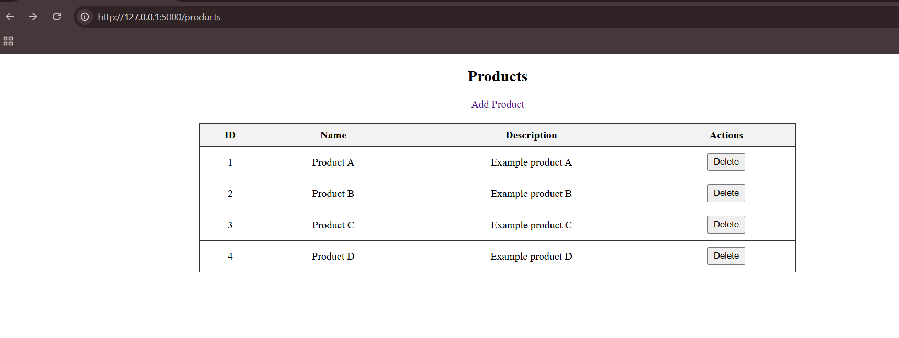
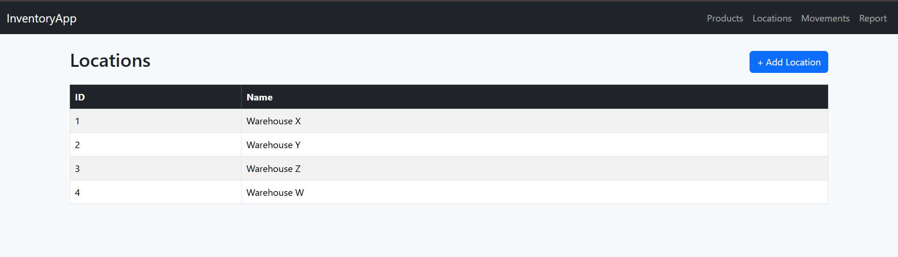
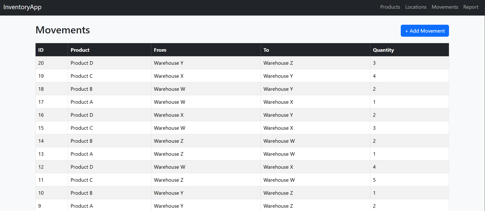
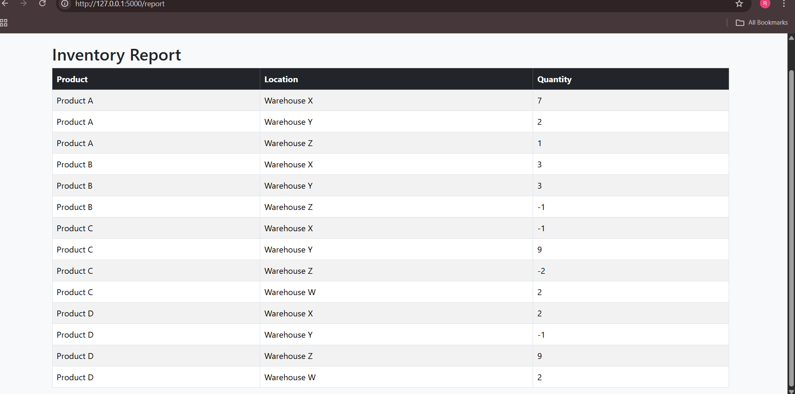

# Flask Inventory Management System

## Overview
This is a web-based Inventory Management System built using **Flask** and **SQLite**.  
It allows users to manage products, locations (warehouses), and track product movements between locations. The system provides an easy-to-use interface and generates reports showing the balance of products in each warehouse.

---

## Features
- Add, Edit, and View Products
- Add, Edit, and View Locations
- Add, Edit, and View Product Movements
- Generate a report showing product balance per location

---

## Use Cases
- Created 3-4 sample Products
- Created 3-4 sample Locations
- Made multiple Product Movements:
  - Move Product A to Location X
  - Move Product B to Location X
  - Move Product A from Location X to Location Y
  - A total of 20 product movements
- Generated report showing Product, Warehouse, and Quantity

---

## Screenshots

### Products Page


### Locations Page


### Movements Page


### Inventory Report



## Setup & Run

1. **Clone the repository**
```bash
git clone https://github.com/RETHANYA10/INVENTORY-MANAGEMENT.git
cd INVENTORY-MANAGEMENT
